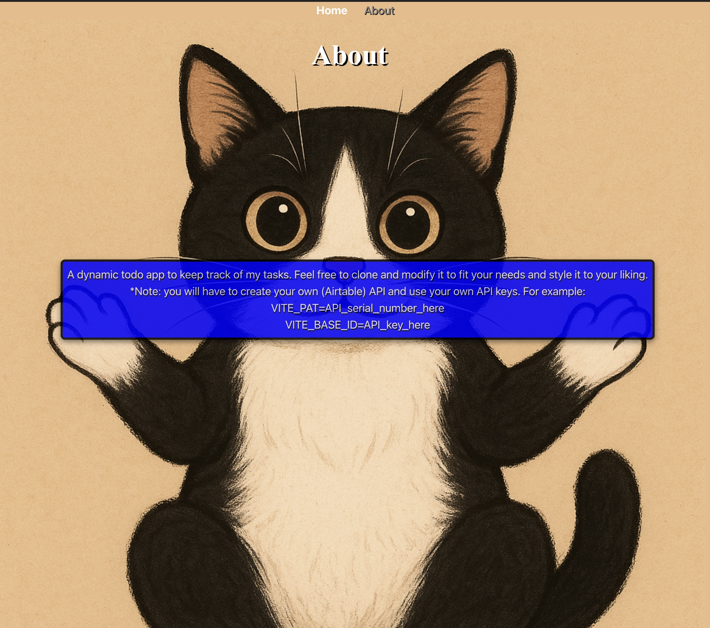

TodoList 

DESCRIPTION:
A dynamic to-do list application featuring controlled components, real-time input validation, and modular component architecture. 

INSTRUCTIONS:

Install with by downloading the zip project or cloning the repository.

Run the development server in Terminal (or Command Prompt) using “npm run dev”

